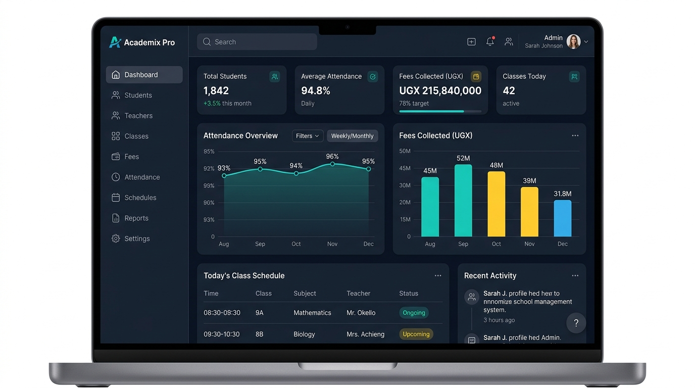

# School Management System



## Overview
A comprehensive, modern School Management System engineered to streamline administrative workflows, enhance teacher-student-parent communication, and centralize academic operations. Built with a robust, scalable architecture, this platform features a Web-based Admin Console and dedicated Mobile Applications for Teachers, Supervisors, and Parents.

## Key Features & Capabilities
* **Role-Based Access Control (RBAC):** Secure, segmented environments tailored for Admins, Teachers, Supervisors, and Parents.
* **Centralized Administration:** Web console for managing users (students, parents, teachers, staff), classes, subjects, and timetables.
* **Real-time Attendance Tracking:** Mobile-first attendance management for teachers, with instant visibility for parents.
* **Academic Performance:** Seamless grading system allowing teachers to input and update final grades, accessible via the parent portal.
* **Communication & Issue Resolution:** Integrated complaint submission and tracking system connecting parents, supervisors, and admins.
* **Event Management:** Keep all stakeholders informed about upcoming school activities and announcements.
* **Ugandan Curriculum Grading:** Full support for NCDC O-Level (20% Formative / 80% Summative) and UACE A-Level 20-point combination calculator.
* **Ugandan Financial ERP:** Fee invoices in UGX, Mobile Money (MTN MoMo / Airtel Money) & SchoolPay webhooks, and receipts.

## Tech Stack
* **Backend:** Node.js, Express, TypeScript / JavaScript, MongoDB
* **Web Admin Console:** React, Vite, TypeScript / JavaScript, Modern Vanilla CSS / Tailwind
* **Mobile Applications:** React Native, Expo, TypeScript

## Platform Showcases
Explore the UI/UX and features for each user role:

* [**Admin Web Console**](./web/screens/admin/README.md)
* [**Parent & Student Portal**](./web/screens/profile/README.md)
* [**Teacher Portal**](./web/screens/teacher/README.md)
* [**Supervisor Portal**](./web/screens/supervisor/README.md)

---

## 🚀 Quick Start

### 1. Clone & Install All Dependencies
```bash
git clone https://github.com/Ndugu2/School_system.git
cd School_system

# Install dependencies across all packages (backend, web, mobile)
npm run install:all
```

### 2. Environment Configuration
- In `/backend/.env`:
  ```env
  PORT=5000
  MONGODB_URI=mongodb+srv://<username>:<password>@<cluster>.mongodb.net/school_system_uganda?retryWrites=true&w=majority
  JWT_SECRET=your_jwt_secret
  JWT_REFRESH_SECRET=your_refresh_secret
  ```
  Create the Atlas database user and allow your development IP in MongoDB Atlas before starting the backend. URL-encode special characters in the database username or password.
- In `/web/.env`:
  ```env
  VITE_API_URL=http://localhost:5000/api
  ```
- In `/mobile/.env`:
  ```env
  EXPO_PUBLIC_API_URL=http://localhost:5000/api
  ```

### 3. Run Locally
```bash
# Option A: Run full stack concurrently (Backend + Web Console)
npm run start

# Option B: Run individual sub-projects
npm run start:backend     # Express API (Port 5000)
npm run start:web         # React Vite Console (Port 5173)
npm run start:mobile      # React Native Expo Mobile App
```

---

## 📖 Complete Documentation
For detailed system architecture, Ugandan curriculum specifications, database models, and module breakdowns, refer to **[SYSTEM_DOCUMENTATION.md](web/docs/SYSTEM_DOCUMENTATION.md)**.

---
*Designed for performance, usability, and scalability in modern educational institutions.*
